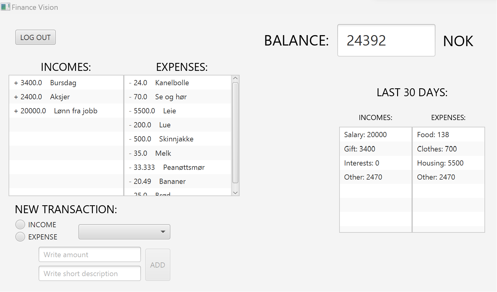

# Finance Vision
Finance Vision er et enkelt program som lar brukeren holde oversikt over sin private økonomi ved å dokumentere alle inntekter og utgifter.

## Opprett bruker og logg inn
Når brukeren starter programmet vil de komme inn på en innloggingsside der de blir bedt om å skrive inn brukernavn og passord for å få tilgang til programmet. Dersom brukeren ikke allerede har en bruker, kan de trykke på knappen for å opprette en bruker. De blir dermed sendt til en ny side hvor de blir bedt om å skrive inn fullt navn, epost og hvor mye penger de har på konto. I tillegg må de opprette et brukernavn og passord. Når brukeren deretter trykker på "opprett bruker"-knappen, vil de bli sendt tilbake til innloggingssiden hvor de nå kan logge inn og få tilgang til programmet.

Innloggingsside: 

Opprett bruker: 

## Hovedsiden
Når brukeren kommer inn på hovedsiden, vil de se en oversikt over inntekter og utgifter, samt et felt som viser saldoen til brukeren. Her kan brukeren også dokumentere alle transaksjoner. De må først definere om det er snakk om inntekt eller utgift. Deretter må de skrive inn beløp og en kort beskrivelese av transaksjonen. Når brukeren deretter trykker på "add"-knappen vil transaksjonen legges til i oversikten over inntekter og utgifter, og saldoen vil oppdateres.

Hovedside: 