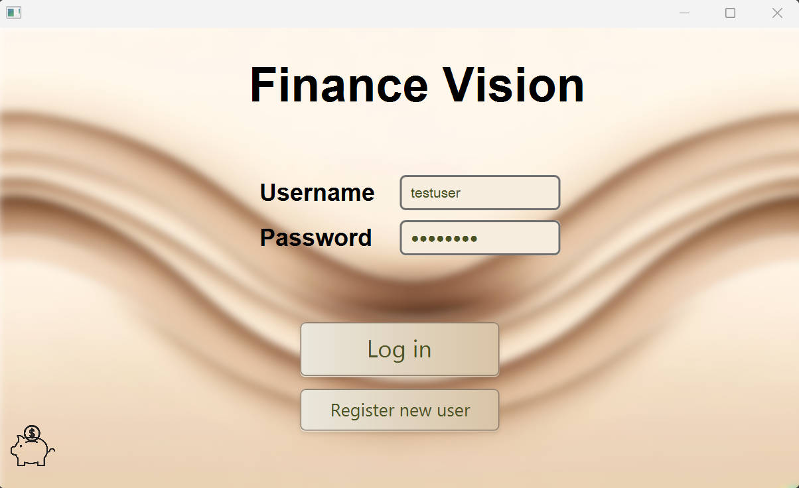
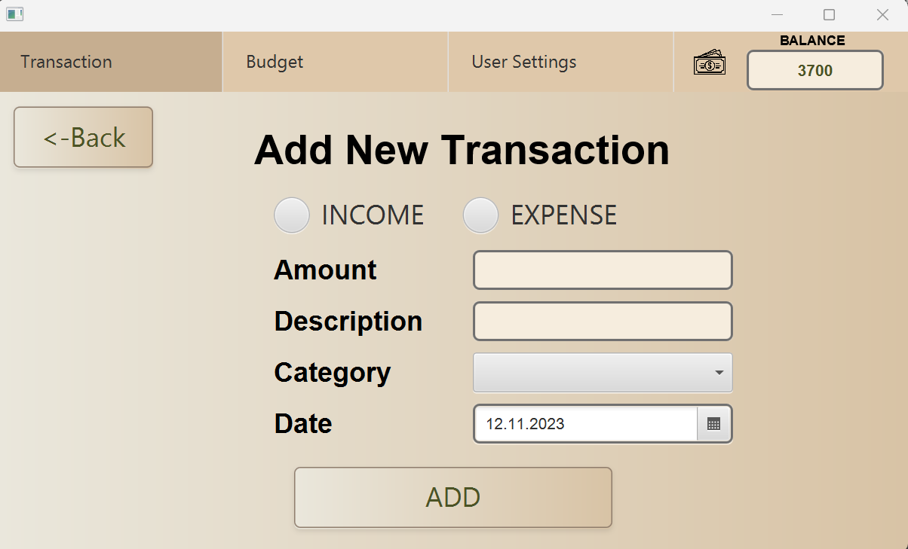
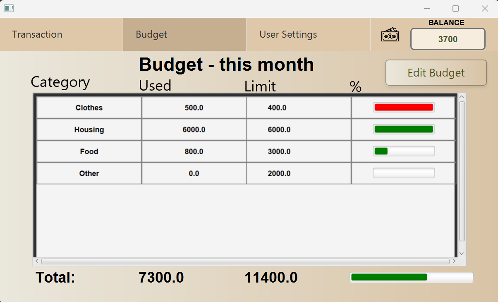

# Finance Vision
FinanceVision er et enkelt program som lar brukeren holde oversikt over sin private økonomi ved å dokumentere alle inntekter og utgifter. Man kan også sette budsjettgrenser for utgiftskategorier.

## Opprett bruker og logg inn
Når brukeren starter programmet vil de komme inn på en innloggingsside der de blir bedt om å skrive inn brukernavn og passord for å få tilgang til programmet. Dersom brukeren ikke allerede har en bruker, kan de trykke på "Register new user". De blir dermed omdirigert til en ny side hvor de blir bedt om å skrive inn fullt navn, epost og hvor mye penger de har på konto. I tillegg må de opprette et brukernavn og passord. Når brukeren deretter trykker på "Register user", vil de bli sendt tilbake til innloggingssiden hvor de nå kan logge inn og få tilgang til programmet.

Innloggingsside: 

Opprett bruker: 

## Hovedside
Når brukeren kommer inn på applikasjonen, vil de øverst på siden se en meny som benyttes til å navigere mellom de tre hovedsidene: "Transactions", "Budget" og "User Settings. I tillegg inneholder menyen et felt som viser saldoen til brukeren.

## Transaksjoner

På transaksjonsiden får brukeren en oversikt over inntekter og utgifter sortert etter dato, der de nyeste transaksjonene står øverst på lista. Denne oversikten kan filtreres slik at brukeren kun viser transaksjoner fra den aktuelle dagen, uka, måneden eller året. Brukeren har muligheten til å legge til transaksjoner ved å trykke på "Add New Transaction". For å redigere eller slette en eksisterende transaksjon, kan brukeren trykke på den ønskede transaksjonen i lista for så å trykke på "Edit transaction" eller "Delete transaction". 

Transaksjonsiden: 

Legg til transaksjon: 

## Budsjett

På budsjettsiden kan brukeren få en oversikt over hvor mye penger de har brukt innen hver kategori for den aktuelle måneden. I kolonnen "used" ser brukeren hvor mye som er brukt og i kolonnen "limit" kan brukeren se en grense for hvor mye som kan brukes innen hver kategori. For å sette og redigere disse budsjettgrensene må brukeren trykke på "Edit Budget" og skrive inn ønsket grense. I tillegg kan brukeren både legge til og slette kategorier ved å trykke på "+"- eller "-"-knappen. Ved å trykke "Confirm" lagres endringene.

Busjettsiden: 

Rediger budsjett: 

## Brukerinstillinger

På siden for brukerinstillinger kan brukeren se en oversikt over profilen sin. Ved å trykke på "Edit User Information" kan brukeren redigere profilen sin. For å slette profilen, kan brukeren trykke på "Delete User" og for å logge ut kan brukeren trykke på "Log Out".

