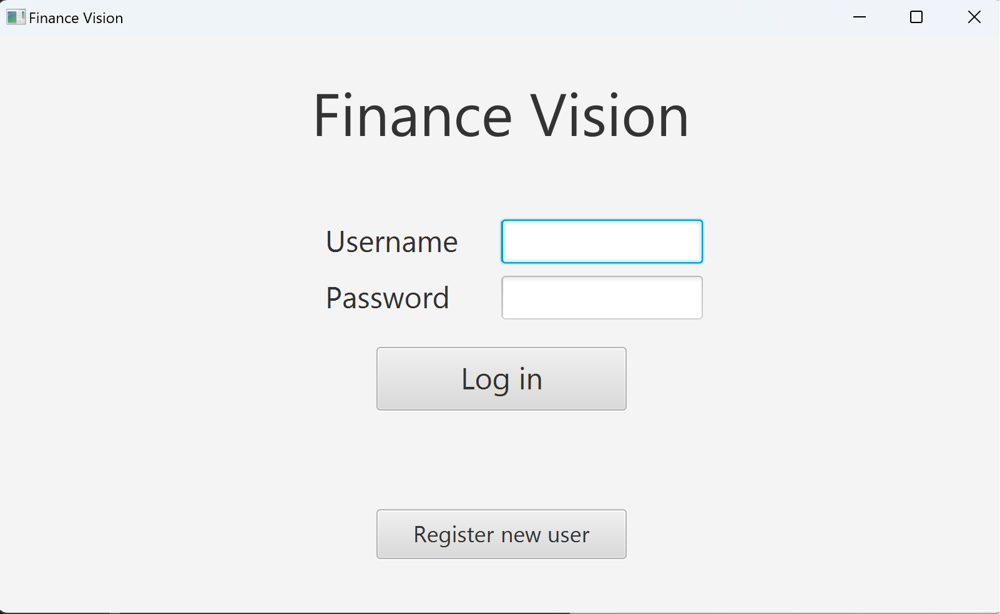
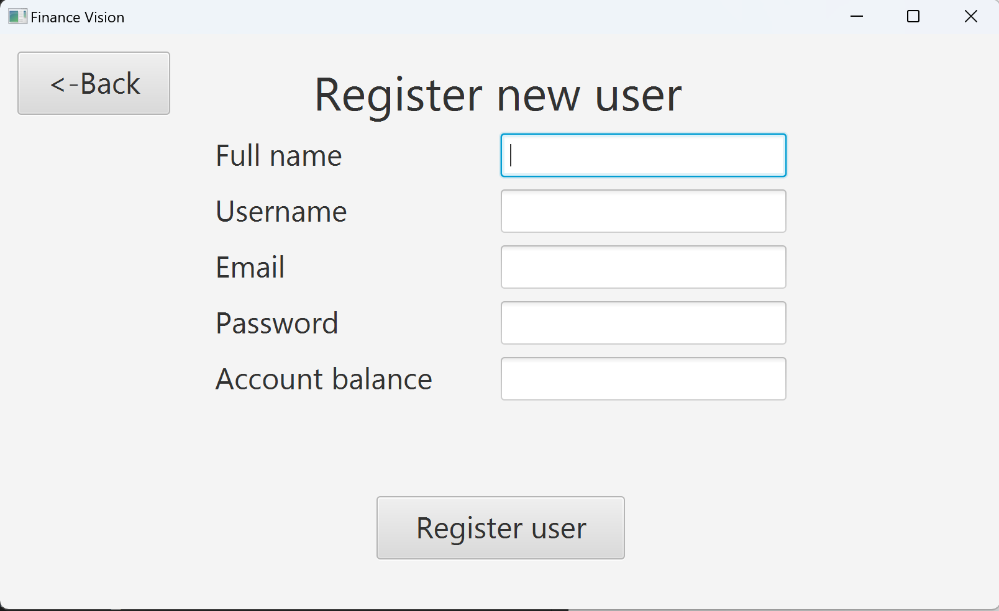
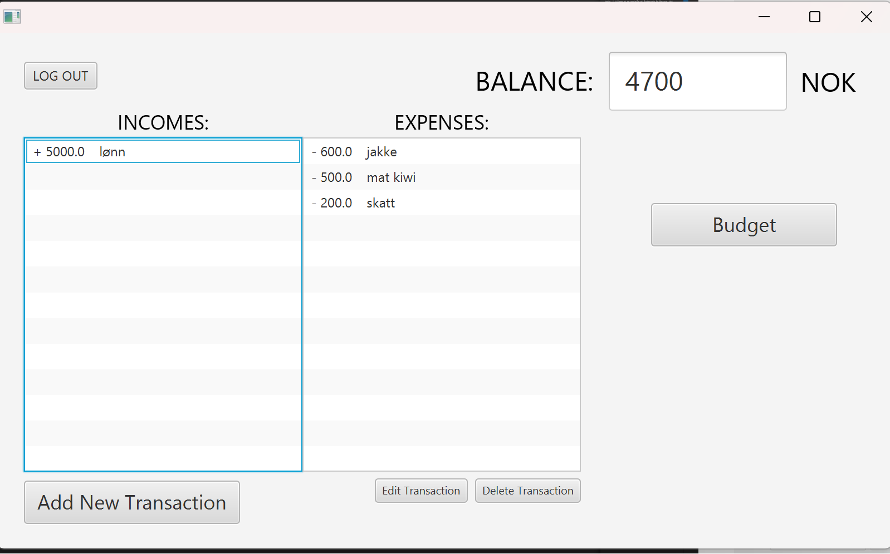
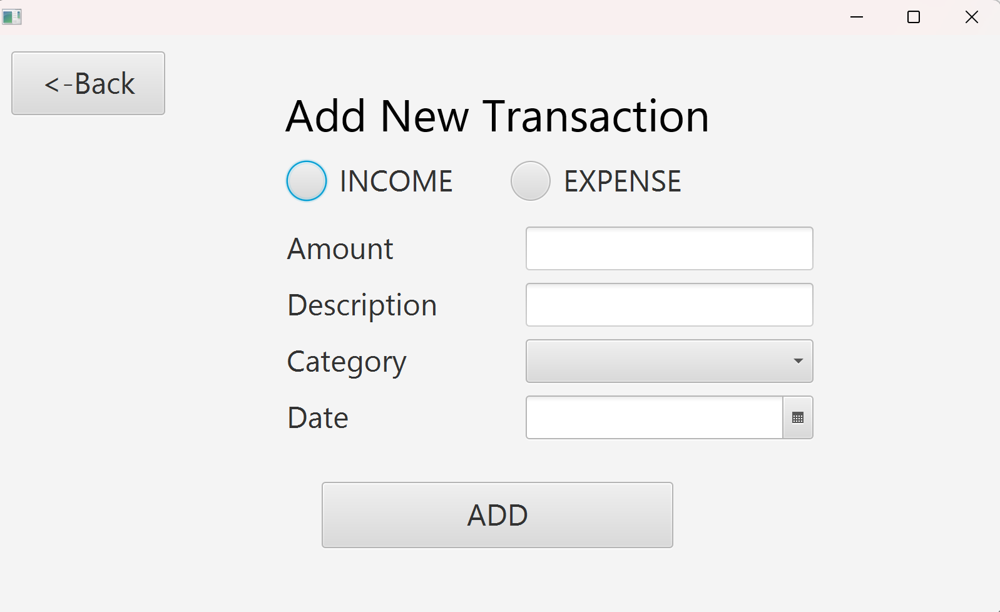
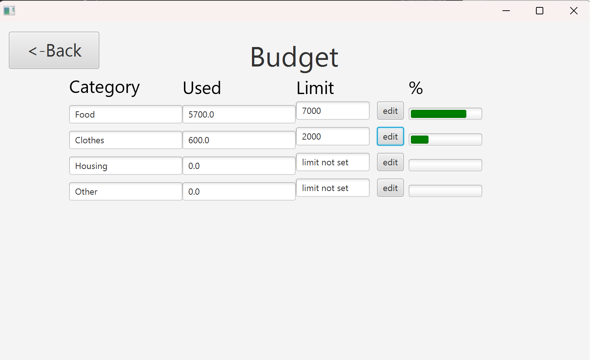

# Finance Vision
FinanceVision er et enkelt program som lar brukeren holde oversikt over sin private økonomi ved å dokumentere alle inntekter og utgifter. Man kan også sette budsjettgrenser for utgiftskategorier.

## Opprett bruker og logg inn
Når brukeren starter programmet vil de komme inn på en innloggingsside der de blir bedt om å skrive inn brukernavn og passord for å få tilgang til programmet. Dersom brukeren ikke allerede har en bruker, kan de trykke på knappen for å opprette en bruker. De blir dermed sendt til en ny side hvor de blir bedt om å skrive inn fullt navn, epost og hvor mye penger de har på konto. I tillegg må de opprette et brukernavn og passord. Når brukeren deretter trykker på "opprett bruker"-knappen, vil de bli sendt tilbake til innloggingssiden hvor de nå kan logge inn og få tilgang til programmet.

Innloggingsside: 

Opprett bruker: 

## Hovedsiden
Når brukeren kommer inn på hovedsiden, vil de se en oversikt over inntekter og utgifter, samt et felt som viser saldoen til brukeren. Her har brukeren muligheten til å sette en transaksjon ved å markere den i lista og trykke "delete transaction". Tilsvarende for å redigere transaksjon. Brukeren kan trykke på "add new transaction" for å legge til en ny transaksjon og "Budget" for å gå til busjettsiden.

Hovedside: 

## Legg til transaksjon
Side for å legge til informasjon om en transaksjon:

## Budsjettsiden
I budsjettsiden har brukeren mulighet til å få en oversikt over transaksjoner sortert på kategori. I kolonnen "used" ser brukeren hvor mye som er brukt på en kategori denne måneden. I kolonnen "limit" kan brukeren sette og se en grense for hvor mye som kan brukes i en kategori per måned. I kolonnen lengst til høyre vises også prosentandelen brukt.

