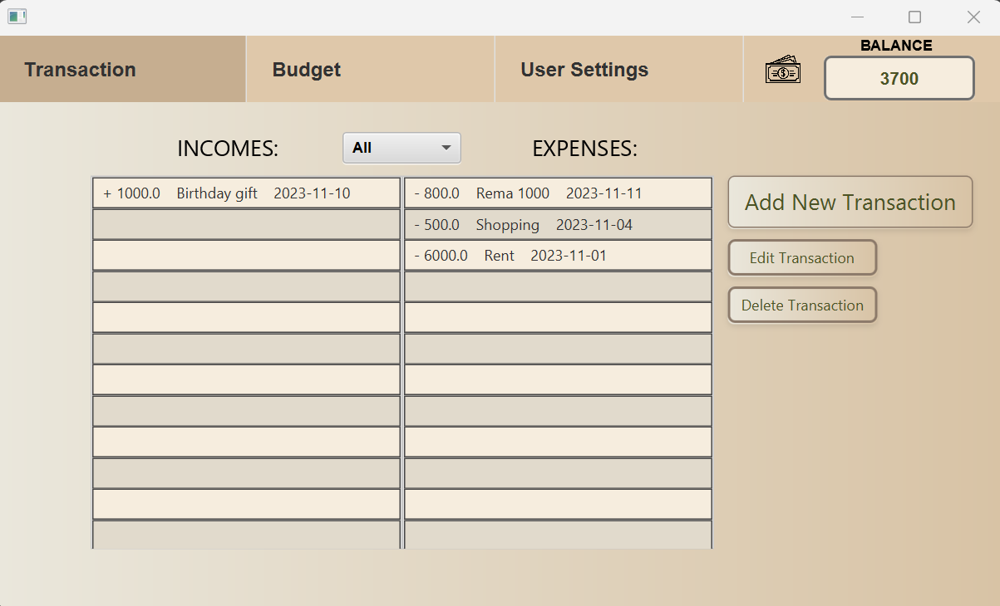
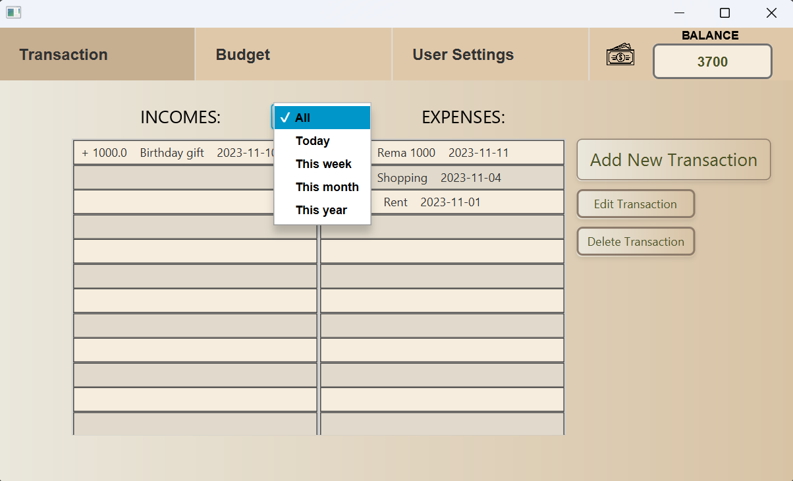
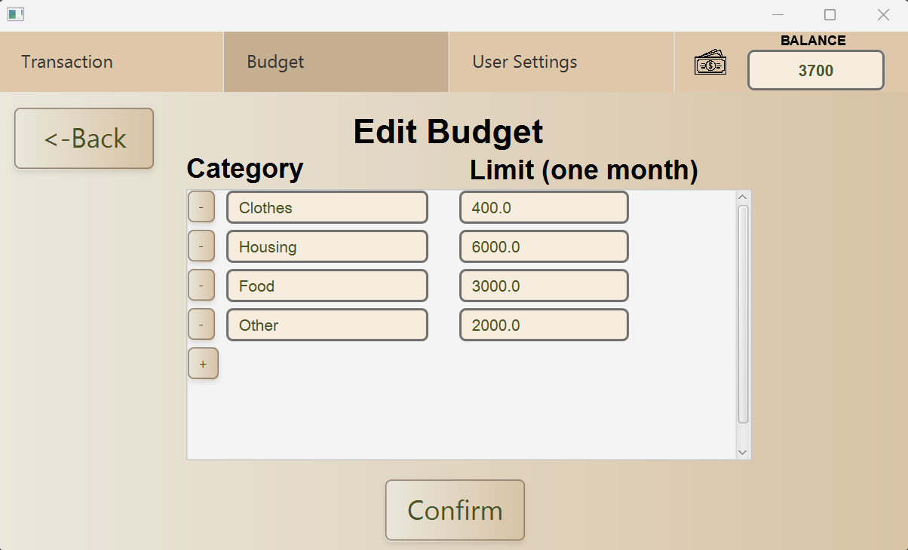
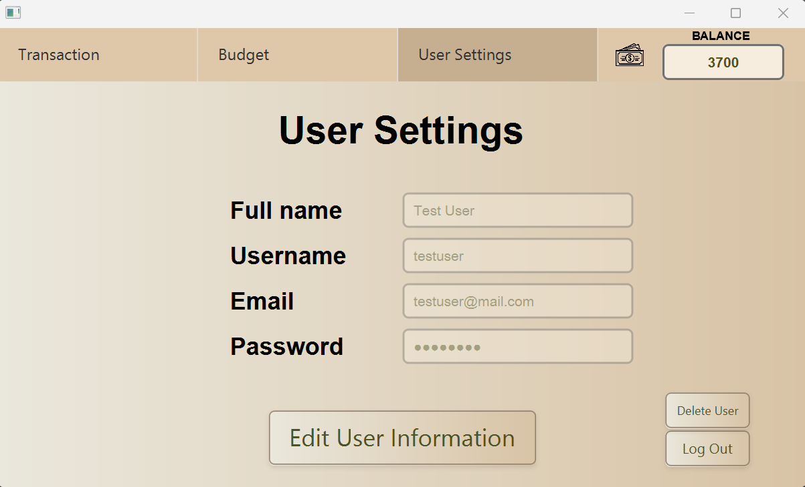

# Release 3

## Introduksjon
Dette dokumentet tar for seg hvilke endringer vi har gjort i FinanceVision-prosjektet siden forrige release.

## Utseende og CSS
I denne releasen har vi fokusert på å ferdigstille brukergrensesnittet slik at brukeropplevelsen blir best mulig. Vi har derfor benyttet et stilark (CSS) som hver av xml-filene peker til. I tillegg er applikasjonen nå tredelt med en meny øverst på skjermen, som kan brukes til å navigere mellom de tre hovedsidene: "Transactions", "Budget" og "User Settings".

## Funksjonalitet
I denne releasen har vi utvidet appen med noe ny funksjonalitet. Først og fremst er det nå en meny øverst på skjermen som brukes til å navigere mellom de tre hovedsidene. Vi har altså opprettet en side for redigering av brukerinformasjon. I tillegg har transaksjonssiden og budsjettsiden fått noe ny funksjonalitet. Vedlagt er en oversikt over disse implementasjonene.

### Transaksjonssiden
- Filtrer transaksjons-liste

### Budsjettsiden
- Legg til og fjern utgiftskategorier

### Brukerinstillinger
- Rediger brukerinformasjon
- Slett bruker
- Logg ut

## REST-API

## Diagram?

## Arbeidsvaner 
- Forholder oss til issues og milestones.
- Vi har forholdt oss til trunk-based branching. Det vil si at hver branch er knyttet til en bestemt issue, og når en issue er fullført merger vi branchen med master-branchen.
- Hver gang vi gjør en endring går vi gjennom checkstyle-warnings før vi merger